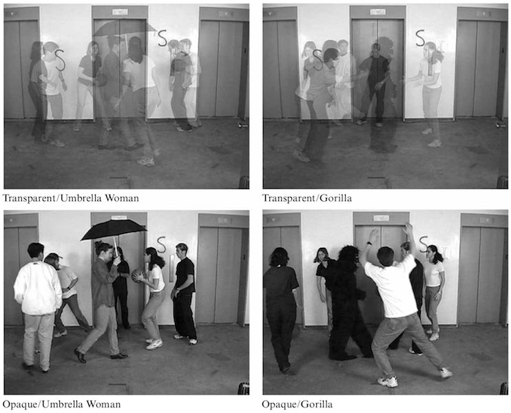

# Wiedza o świecie społecznym

## Świat społeczny a procesy poznawcze
- Świat społeczny jest światem interpretowanym
- Każdy człowiek odbiera go inaczej i inaczej interpretuje

## Schematy poznawcze (*schema*)
- Schemat poznawczy – organizacja uprzednich doświadczeń z jakimś zdarzeniem, osobami czy obiektami
- Schematy są uogólnione, abstrakcyjne. Konkretne są **egzemplarze** schematów
- Np. typowy przebieg egzaminu – schemat, egzamin z psychologii społecznej u Basińskiego – egzemplarz schematu
- Zasada **prototypowości** – najwięcej o schemacie mówi najbardziej typowy jego egzemplarz

## Schematy poznawcze (*schema*)
- Schematy osób – stereotypy – więcej w przyszłym semestrze
- Schematy cech
- Skrypty

## Skrypty
- Inaczej *scenariusze* – dotyczą przebiegu wydarzeń
- Przykładowo – przebieg egzaminu ustnego, wizyty u lekarza, lotu samolotem itd.
- Pojedyncze elementy skryptu – scenki – mogą być bardziej albo mniej prototypowe
- Scenki mają *kolejność czasową*

## Schematy cech
- Cechy (np. inteligencja, towarzyskość, grzeczność) mają swoje przejawy w postaci zachowań
- Niektóre zachowania są bardzo charakterystyczne dla jakiejś cechy – *prototypy*. Inne mniej, jeszcze inne nie są wcale
- Częścią schematów cech jest też ich współzmienność (np. „skoro jest inteligentny to pewnie jest też mądry”, „skoro jest grzeczny to pewnie jest moralny” itd.)

## Trzy warunki zastosowania schematu
- Wykształcenie schematu
- Stosowalność do sytuacji
- Aktywizacja

## Różnice kulturowe w wykształconych schematach
- Statystyczny student z USA zazwyczaj czuje się *„lepiej niż zazwyczaj”* (Johnson, 1937)
- Statystyczny student z Polski zazwyczaj czuje się *„gorzej niż zazwyczaj”* (Doliński, 1996)
- Różnica w schemacie powitania (*"I’m OK, I’m great"* vs *„nie mogę narzekać”*, *„jako tako”*)
- Kultura narzekania

## Aktywizacja schematu
- Schemat może być aktywizowany **percepcyjnie** – zaobserwowaliśmy jakiś obiekt, coś się wydarzyło i z tego powodu aktywizuje się schemat
- Może też być aktywizowany **przedpercepcyjnie**, tj. najpierw aktywizuje się schemat, a później dopiero jest stosowany do napływających informacji
- Przedpercepcyjna aktywizacja schematu - klasyczne badanie Higginsa (1977) – tekst o Donaldzie

>Donald spędza wiele czasu w poszukiwaniu, jak to nazywa – dreszczyku podniecenia. Już zdobył najwyższy szczyt na kontynencie, przepłynął kajakiem niebezpieczne porohy, jeździł samochodem wyścigowym i pościgową łodzią choć niewiele wie o łodziach. Wiele razy ryzykował zdrowiem, a nawet życiem. Teraz myśli o skokach spadochronowych albo o samotnym przepłynięciu Atlantyku jachtem. Ze sposobu postepowania Donalda łatwo odgadnąć jego przekonanie o własnej zdolności do poradzenia sobie z wieloma wyzwaniami. Jego kontakty z ludźmi są – poza życiem zawodowym – dość ograniczone. Kiedy już raz się na coś zdecyduje, dopnie swego, choćby nie wiem co. Rzadko zmienia decyzje, nawet gdyby dla niego samego lepiej było zmienić zdanie.

## Jaki jest Donald?

> Donald spędza wiele czasu w poszukiwaniu, jak to nazywa – dreszczyku podniecenia. Już zdobył najwyższy szczyt na kontynencie, przepłynął kajakiem niebezpieczne porohy, jeździł samochodem wyścigowym i pościgową łodzią choć niewiele wie o łodziach. 

> Wiele razy ryzykował zdrowiem, a nawet życiem. Teraz myśli o skokach spadochronowych albo o samotnym przepłynięciu Atlantyku jachtem 
*(odważny - lekkomyślny)*. 

> Ze sposobu postepowania Donalda łatwo odgadnąć jego przekonanie o własnej zdolności do poradzenia sobie z wieloma wyzwaniami 
*(pewien siebie – zarozumiały)*. 

> Jego kontakty z ludźmi są – poza życiem zawodowym – dość ograniczone 
*(niezależny – samotnik)*. 

> Kiedy już raz się na coś zdecyduje, dopnie swego, choćby nie wiem co. Rzadko zmienia decyzje, nawet gdyby dla niego samego lepiej było zmienić zdanie 
*(wytrwały – uparty)*.

## Przedpercepcyjna aktywizacja jest tym bardziej prawdopodobna, im...

- …silniejsze jest subiektywne oczekiwanie pojawienia się egzemplarzy schematu w otoczeniu
- …silniej egzemplarze schematu powiązane są z realizacją celów i motywów podmiotu
- …krótszy czas upłynął od poprzedniego zaktywizowania schematu
- …częściej dany schemat był aktywizowany w przeszłości

## "Nieświadomość" inaczej - procesy automatyczne vs. kontrolowane

- Przetwarzanie **automatyczne**:
    + Bez intencji podmiotu
    + W odpowiedzi na pewne bodźce mimo lub wbrew woli podmiotu
    + Bezwysiłkowe, szybkie i nie pochłania zasobów operacyjnych (uwagi i pamięci roboczej)
    + Przebiega poza świadomością podmiotu
- Przetwarzanie **kontrolowane**: 
    + intencjonalne 
    + wolicjonalne 
    + powolne 
    + pochłaniające zasoby
- Problem: to nie do końca prawda 
- Wymiar automatyczności (Chaiken i Trope, 1999) – niektóre procesy są bardziej automatyczne, inne mniej

## Przetwarzanie automatyczne w laboratorium- *priming*
- *Priming* czyli prymowanie
- Dwa etapy:
    + Aktywizacja jakiejś struktury wiedzy za pomocą prymy (primer)
    + Wykonanie właściwego zadania
- Pryma może być świadoma albo nieświadoma (np. bodziec podprogowy)
- Badany nie może powiązać prymy z właściwym zadaniem
- Przykłady: 
    + badanie Higginsa o Donaldzie 
    + rozsypanki słowne („kota w rzucił Janek kamieniem”) 
    + podprogowe pokazywanie słów, obrazów
    
    
    
    
# Spostrzeganie świata społecznego    

## The monkey business illusion
<https://www.youtube.com/watch?v=IGQmdoK_ZfY>

<http://theinvisiblegorilla.com>

## The monkey business illusion - warunki

- Zadanie łatwe - policz ilość podań
- Zadanie trudne - policz osobno ilość podań z kozłem i bez

Warunki |	Zadanie łatwe |	Zadanie trudne
----:|:----:|:----
Nieprzezroczyste	|   |	
   Kobieta |	100% |	83%
  Goryl |	42% |	50%
Przezroczyste	|   |	
  Kobieta	| 58% | 33%
  Goryl	| 8%	| 8%
  
  

## Pranie w pralce

<small>Postępowanie jest w istocie zupełnie proste. Przede wszystkim należy poukładać poszczególne pozycje w różne grupy. Oczywiście wystarczyć może tylko jedna grupa, w zależności od tego, jak wiele jest do zrobienia. Ważne jest, aby nie przesadzić. To znaczy lepiej załatwić za jednym razem za mało rzeczy niż za dużo. Na krótką metę może to się wydawać nieważne, ale łatwo tu o komplikacje. Pomyłka może być także kosztowna. Kiedy postępowanie jest już zakończone, należy rzeczy z powrotem poukładać w poszczególne grupy. Potem mogą one zostać odłożone na właściwe miejsce. Niewątpliwie zostaną użyte jeszcze raz i cały cykl znów zostanie powtórzony.</small>

## Interpretacja znaczenia a schematy
- Bez nagłówka, mimo użycia zrozumiałych słów i konstrukcji gramatycznych, nie mamy pojęcia czego dotyczy tekst
- Zapamiętywanie go poprawia się dwukrotnie, jeśli jest opatrzony nagłówkiem

## Pamięć a schematy
- Generalnie pamiętamy lepiej informacje zgodne ze schematem – efekt zgodności
- Pamiętamy też lepiej informacje silnie niezgodne ze schematem (np. „psycholog, który unika ludzi”) – efekt sprzeczności
- Efekty te są równie silne i przyrastają w momencie, gdy:
    + Rośnie stopień wykształcenia schematu
    + Wzrasta obciążenie pamięci
    + Wydłuża się czas między zapamiętaniem a odtworzeniem materiału
    + Oba momenty są rozdzielone wykonywaniem innych zadań umysłowych
    
## Skrypty a regulacja zachowania (Langer, 1978)

- *„Przepraszam, czy możesz mnie wpuścić bez kolejki? Bardzo się spieszę”*
- *„Przepraszam, czy możesz mnie wpuścić bez kolejki? Chciałbym coś skserować”*
- *„Przepraszam, czy możesz mnie wpuścić bez kolejki?”*

| Prośba         | Uzasadnienie |         |             |
|----------------|--------------|---------|-------------|
|                | Brak         | Pozorne | Rzeczywiste |
| Mała (5 str.)  | 0.60         |	0.93    |	0.94        |
| Duża (20 str.) | 0.24         |	0.24    |	0.42        |
Proporcja osób ulegającej małej bądź dużej prośbie w zależności od rodzaju uzasadnienia

Wniosek: dopóki koszty są niewielkie, realizujemy skrypty bezwiednie i bezkrytycznie.

## Wyrazistość
- Osoby wyraziste przyciągają większą uwagę, więc są lepiej pamiętane
- Są postrzegane jako wywierające większy wpływ społeczny
- Osoby wyraziste są oceniane w bardziej krańcowy sposób (np. jeden kulturalny Rosjanin wśród Polaków będzie postrzegany jako bardziej kulturalny, niż gdy byłby w towarzystwie Rosjan)

# Heurystyki

- Świat dostarcza potężnych ilości informacji
- Heurystyki to umysłowe „drogi na skróty”
- Pozwalają rozwiązywać problemy przy użyciu niewielkiej ilości zasobów
- Metody rozwiązywania problemów (z matematyki):
    + Algorytm – trudny, powolny, dużo zasobów, niezawodny
    + Heurystyka – prosta, szybka, mało zasobów, przeważnie działa

- Rodzaje heurystyk (Kahnemann i Tversky):
    + H. dostępności
    + H. zakotwiczenia-dostosowania
    + H. reprezentatywności

## Heurystyka dostępności
- Jeśli przychodzi nam do głowy dużo przykładów na jakieś zjawisko to na pewno jest ono powszechne
- Zwykle działa, bo zdarzenia częste są łatwo dostępne pamięciowo
- Co jest częstszą przyczyną śmierci w Polsce? Zabójstwo czy samobójstwo?
- Co jest bardziej niebezpieczne, podróż samolotem czy jazda na rowerze?
- (2014r. – w USA 726 ofiar śmiertelnych wśród rowerzystów, 692 ofiary wypadków lotniczych *na całym świecie*)

## Heurystyka zakotwiczenia-dostosowania
- Oceniając wartość liczbową czegoś, obieramy za punkt wyjścia łatwo dostępną liczbę (np. podaną przez kogoś), a następnie modyfikujemy w zależności od kontekstu
- Okazuje się, że przy takim szacowaniu mamy tendencję do zawyżania/zaniżania w stronę podanej przez kogoś wartości
- Np. cena nieruchomości podawana przez agentów, targowanie się itd..

## Heurystyka reprezentatywności
- Oceniamy przynależność jakiegoś obiektu do kategorii na podstawie jego podobieństwa do typowych egzemplarzy kategorii
- Może prowadzić do błędów, jeśli np. nie zdajemy sobie sprawy ze struktury populacji (np. efekt kohorty)

## Kahnemann & Tversky, 1973
- Opis osoby "losowany" z próby inżynierów i prawników
- Dwa rodzaje opisów:
    1. *„Dick is a 30 year old man.”* 
    2. *„Dick is a 30 year old man. He is married with no children. A man of high ability and high motivation, he promises to be quite successful in his field. He is well liked by his colleagues.”* 
- Pytanie - jakie jest prawdopodobieństwo, że Dick jest prawnikiem jeśli:
    + opis był losowany z próby, gdzie prawników i inżynierów było po równo?
    + opis był losowany z próby 30 prawników i 70 inżynierów?

Stosunek prawników do inżynierów  |  Opis bez informacji  |  Opis informatywny
---|---|---
50 prawników / 50 inżynierów | 50% | 50% 
30 prawników / 70 inżynierów |  30% | **50%!**
